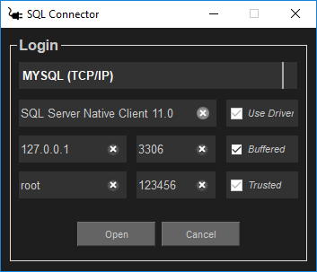
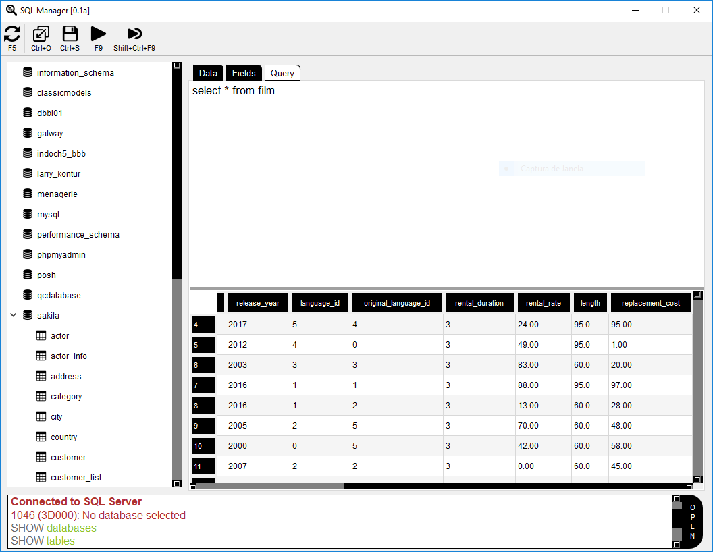
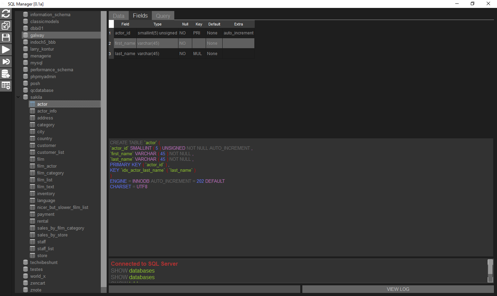
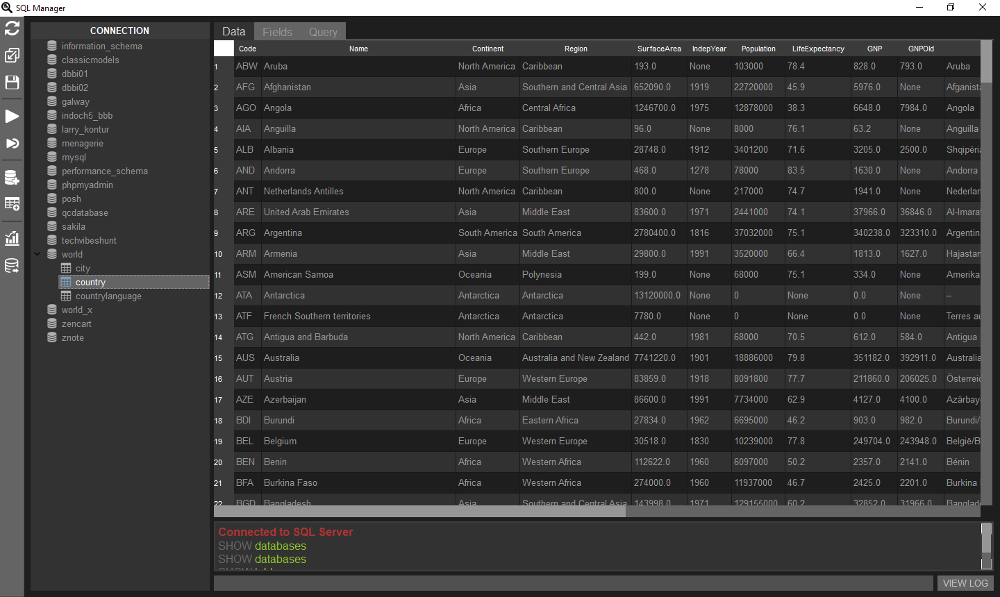

<h1 align="center">
   
    
   
  MYQT 
  MySQL Database Manager
   
   
</h1>

<h4 align="center">MySQL Querying Tool with QT Designer</h4>

 

 
 

MYQT is an open source visual database design and querying tool for the MySQL database developed in python using the QT (Cute) framework for creating  interface, Developed by Fernando Moreira between 2018 - 2019

# Interface Help
1. Two clicks on a database to use it
2. Two clicks on a table within the active database
to see all your information

# Features
<pre>
- Database Connection & Instance Management
- Wizard driven action items
- Fully scriptable with Python
- Support for custom plugins and themes
- Schema object browsing, inspection, and search
- SQL syntax highlighter and statement parser
- Multiple and editable result sets
- Visual EXPLAIN
- SQL snippets collections
</pre>

# Shortcuts Usage
<pre>
- Refresh changes           -> (F5)
- Execute QUERY             -> (F9) 
- Import query              -> (Ctrl + O) 
- Export query              -> (Ctrl + S) 
- Execute selected QUERY    -> (Ctrl + Shift F9)
</pre>

# Dependencies
<pre>
Python >= 3 with at least the following modules is required:

- pip install -r requirements.txt
- mysql-connector           = 2.1.6
- mysql-connector-python    = 8.0.13
- mysql-connector-python-rf = 2.2.2
- PyQt5                     = 5.11.3
- PyQt5-sip                 = 4.19.13   
</pre>

# Interface UI
 

---

#### Author : Fernando Ferreira Moreira   CC0 - 2018 Creative Commons

