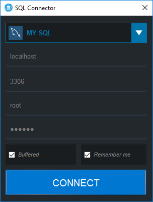
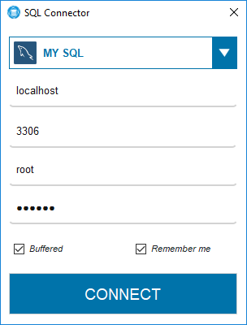
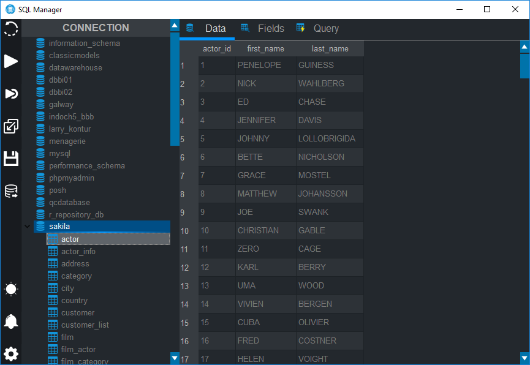
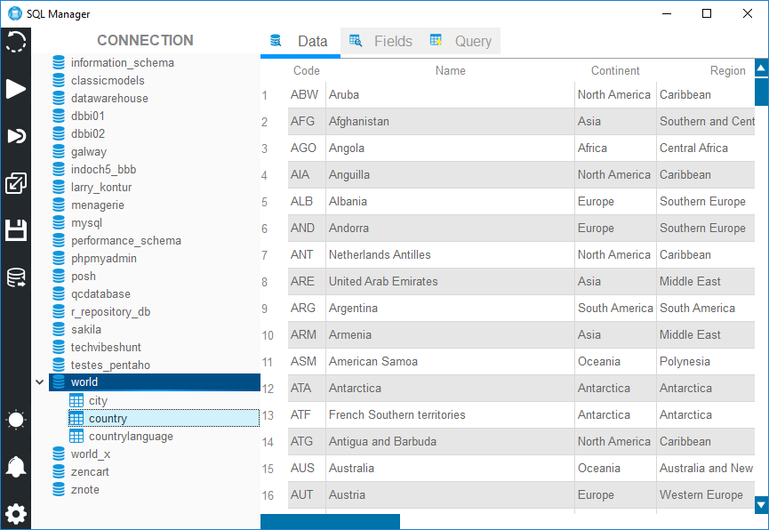

<h1 align="center">
     
    
     
    MYQT
     
    SQL Querying Tool with QT Designer
     
</h1>

<h1 align="center">
    
    
    
        
     
    
    
    
    
</h1>

MYQT is an open source visual database design and querying tool. Developed in python using the QT(Cute) framework for creating  interface, Developed by Fernando Moreira between 2018 - 2019 

# **Interface Help**
<pre>
- Two clicks on a database to use it
- Two clicks on a table within the active database to see all your information

- Refresh changes           -> (F5)
- Execute QUERY             -> (F9) 
- Import query              -> (Ctrl + O) 
- Export query              -> (Ctrl + S) 
- Execute selected QUERY    -> (Ctrl + Shift F9)
</pre>

# **Features**
<pre>
 Database Connection & Instance Management
 Fully scriptable with Python
 Support for custom plugins and themes
 Schema object browsing, inspection, and search
 Multiple and editable result sets
 Export table to csv/txt/all other files
 SUPPORT MYSQL
 SUPPORT SQL SERVER
 SUPPORT POSTGRES 
 Dark and white theme
 Import table from xlsx/csv/txt/etc file
 SQL snippets collections
 Matplot data visualizer
 SQL syntax highlighter and statement parser
</pre>

# **Dependencies**

<pre>
Python >= 3 with at least the following modules is required:
- PyQt5                      : ^5.11.3
- PyQt5-sip                  : ^4.19.13
- mysql-connector            : ^2.1.6
- mysql-connector-python     : ^8.0.13
- mysql-connector-python-rf  : ^2.2.2
- pymssql                    : ^2.1.4
- psycopg2                   : ^2.8.1
</pre>

# **Connector**

# **Manager**

---
 
Author : Fernando Ferreira Moreira   Apache License 2.0
