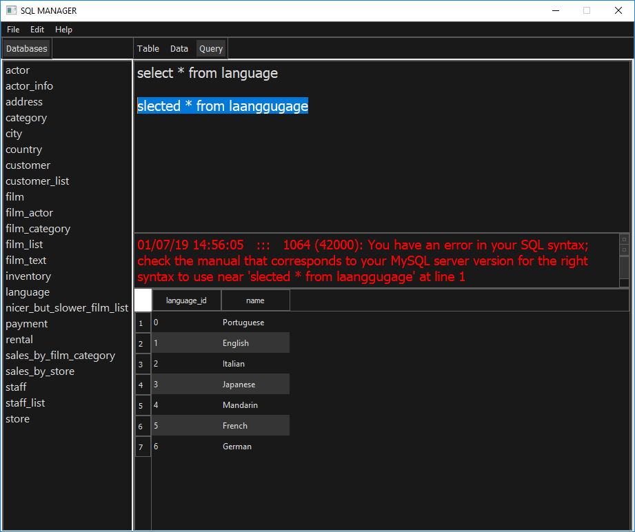

# SQL Manager

SQL Manager é um programa livre e com código-aberto para o MySQL, Microsoft SQL SERVER e PostgreSQL

---
## Connector
 
## Manager
 

 

## Detalhes Gerais
- SQL Manager é desenvolvido em python
- Desenvolvido por Fernando Moreira entre 2018 - 2019

## Alguns detalhes técnicos
- SQL Manager é desenvolvido em Python
- Usando o framework PYQT para criação de interfaces (GUI)
 

 

---

**Author : Fernando Ferreira Moreira** 
**CC0 - 2018 Creative Commons**
