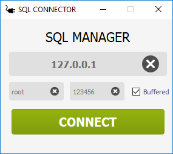
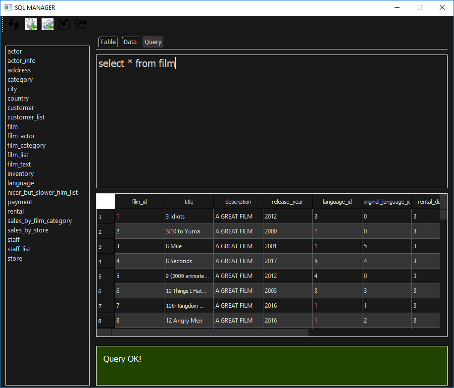
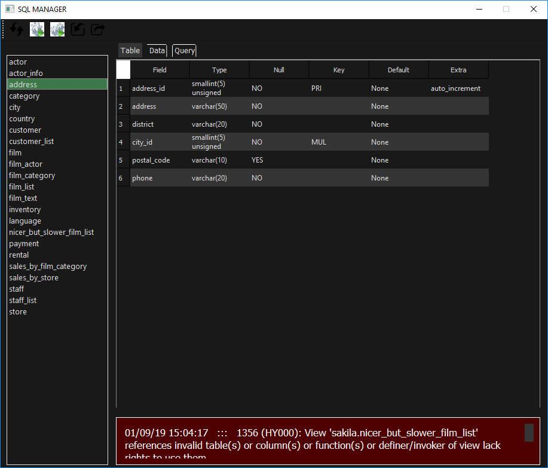
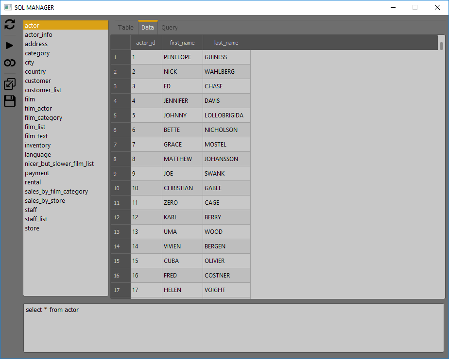

# SQL Manager

SQL Manager is a free, open source application for MySQL database manager

## General Details
- This software is developed in python using the QT (Cute) framework for creating  interface 
- Developed by Fernando Moreira between 2018 - 2019

## Shortcuts Usage
<pre>
- Refresh changes           -> (F5)
- Execute QUERY             -> (F9) 
- Import query              -> (Ctrl + O) 
- Export query              -> (Ctrl + S) 
- Execute selected QUERY    -> (Ctrl + Shift F9)
</pre>

## Using interface
- Two clicks on a database to use it
- Two clicks on a table within the active database
to see all your information (Table columns type / Table data)

# Interface

 

---

**Author : Fernando Ferreira Moreira**
**CC0 - 2018 Creative Commons**
